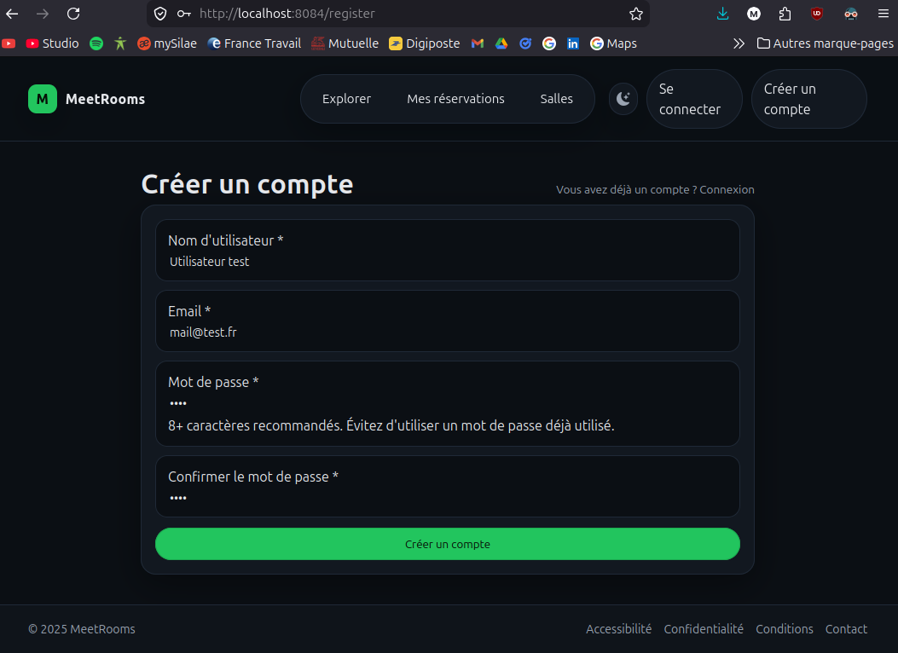
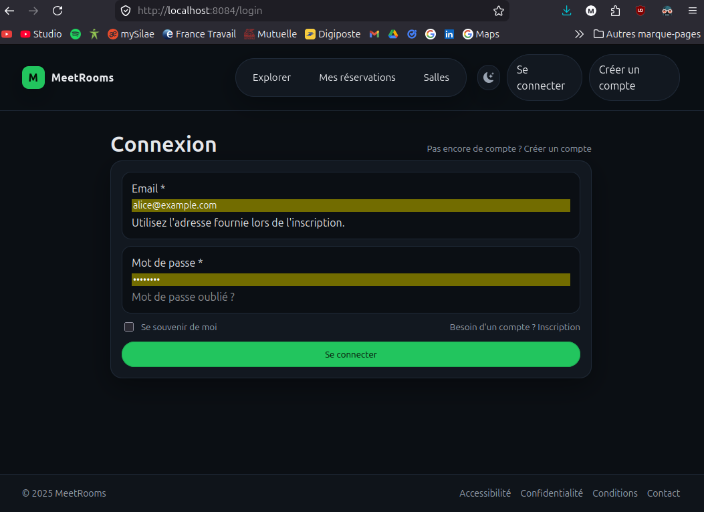
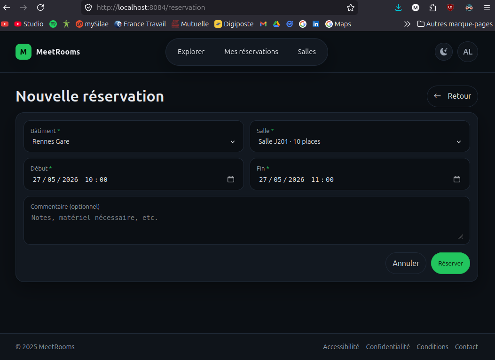
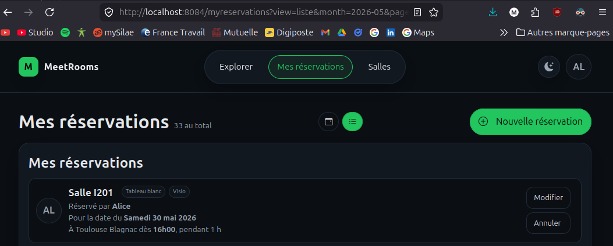
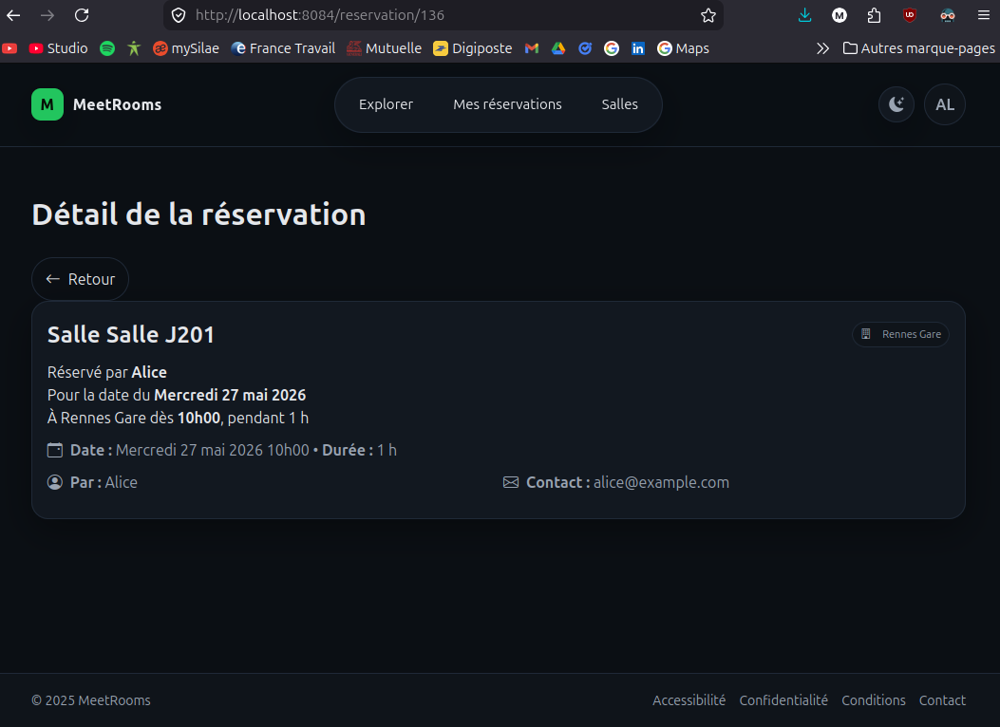

# MeetRooms — Manuel Utilisateur

Bienvenue sur MeetRooms, l'outil interne de réservation de salles de réunion du groupe AssurNova.

---

## 1. Créer un compte

Si c'est votre première connexion, cliquez sur **"Créer un compte"** depuis la page d'accueil et renseignez votre nom, adresse e-mail et mot de passe.

---

## 2. Se connecter

Rendez-vous sur la page d'accueil et cliquez sur **"Se connecter"**. Saisissez votre adresse e-mail et votre mot de passe.

> Compte de démonstration : `alice@example.com` / `password`

---

## 3. Thème visuel

En haut à droite de chaque page, un interrupteur vous permet de basculer entre le mode clair et le mode sombre. Votre préférence est automatiquement sauvegardée dans votre navigateur et reste active d'une page à l'autre.

---

## 4. Réserver une salle

1. Depuis la page d'accueil, cliquez sur **"Explorer"** ou sur le bouton **"Nouvelle réservation"**.
2. Sélectionnez le bâtiment puis la salle souhaitée.
3. Choisissez la date et l'heure de début — l'heure de fin est automatiquement préremplie à +1h.
4. Ajustez l'heure de fin si nécessaire, puis ajoutez un commentaire optionnel.
5. Cliquez sur **"Réserver"** pour confirmer.

> En cas de conflit avec une réservation existante, le système vous en informe et annule l'action.

---

## 5. Gérer ses réservations

Cliquez sur **"Mes réservations"** dans le menu principal pour consulter l'ensemble de vos créneaux, passés et à venir.

Depuis cette liste, vous pouvez **Modifier** ou **Annuler** uniquement vos propres réservations. Cliquez sur une réservation pour en voir le détail complet.

---

## 6. Administrateurs

Les administrateurs disposent de droits étendus :

- Accès au planning global de toutes les salles et de tous les utilisateurs.
- Possibilité de modifier ou annuler n'importe quelle réservation (utile pour libérer une salle en cas de désistement non signalé).
- Accès à une vue d'administration dédiée listant toutes les réservations.
